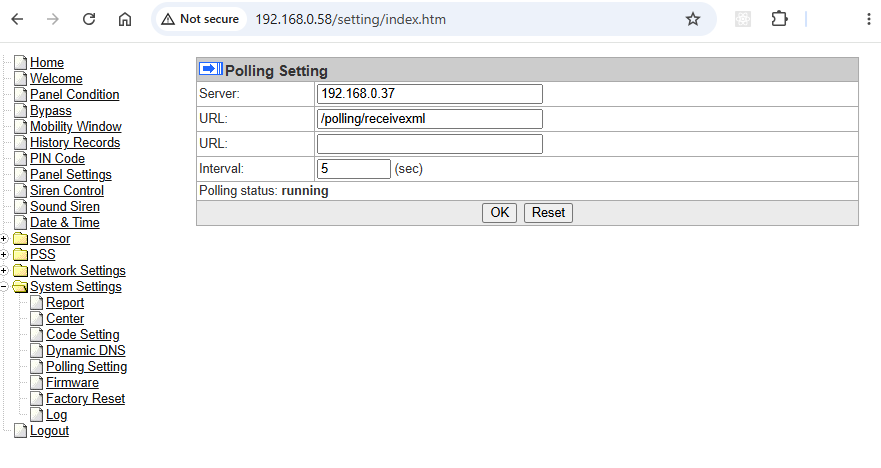
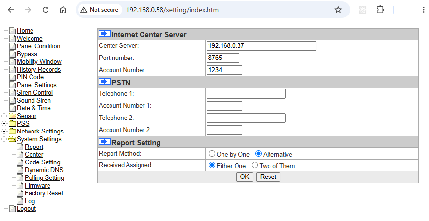

# Configuring an CTC-1735 for use with this project

To complete configuration you must obtain access to the hub's internal web interface. 

Please see the MZ-1 setup guide for information about how to access the web interface. The username / password should also be admin / admin1234.

First navigate to the "Polling Setting" screen:

Set the server to the address of your server. The path should be changed to `/polling/receivexml`. The port is hard coded to 80 inside the alarm hence why this projects defaults the "polling" port to 80. This is the remote management interface.

Now head to the "Report" screen.

Set the server to the address of your server. Port 8765. These alarms only accept a 6-digit account number. Make up a number and set the same number in the `account_number` property in the section for this alarm in `config.toml`. This is so that the server can identify the alarm when an incoming CID message is received.