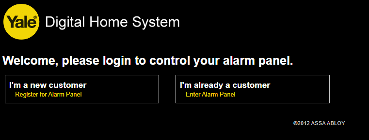
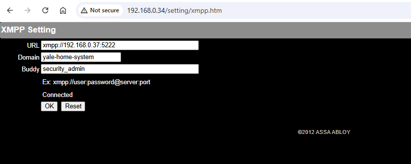
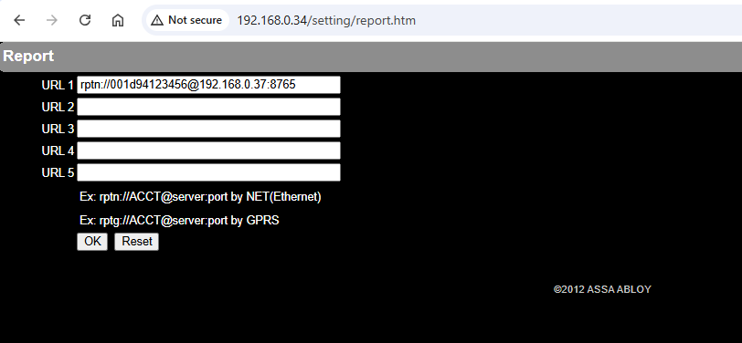
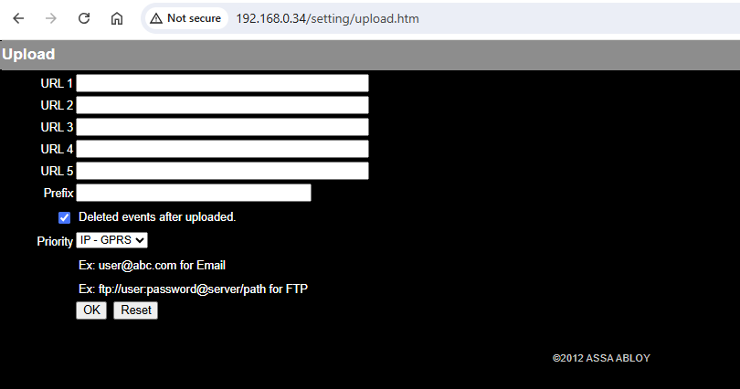

# Configuring an CTC-1815 for use with this project

To complete configuration you must obtain access to the hub's internal web interface. 

The Yale branded CTC-1815's web interface is a lot more polished than later models - looking possibly if customer access was permitted. No documentation for this model appears to be available on the Yale website. As of 2026 it does **not** work with the official server / Yale app. The person it was purchased from stated it was last seen working in 2021.

Please see the MZ-1 setup guide for information about how to access the web interface. The username / password should also be admin / admin1234.

Upon logging in you will be greeted with a welcome screen:

Hit "I'm already a customer". Oddly the register link leads to a sign-up page on Climax's Taiwanese server, which the hub wasn't configured to connect to at all, and doesn't allow this hub to be registered anyway.

There is no link in the navigation menu to configure the XMPP server. Manually enter the path "/setting/xmpp.htm" into the URL bar. Replace yalehomesystem.co.uk with your own server address.

There's no link to the CID report setting screen either. Once again enter the path manually into your browser: "/setting/report.htm". Configure as above. Replace the server address with your own and set the prefix to be the alarm MAC address all lowercase.

For belt and braces the media upload section could be configured but this hub had nothing set here and several attempts to pair a PIR camera device to it were unsuccessful.
# That's it!

Your alarm's connection to Yale's server is now completely severed. All communications channels are redirected to your own server. You now have full ownership of your alarm system.