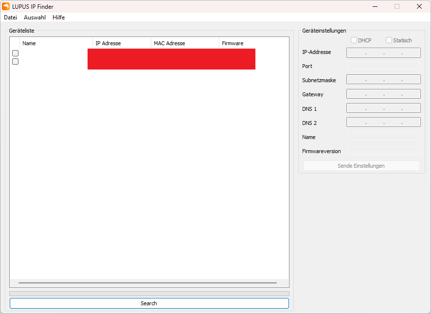
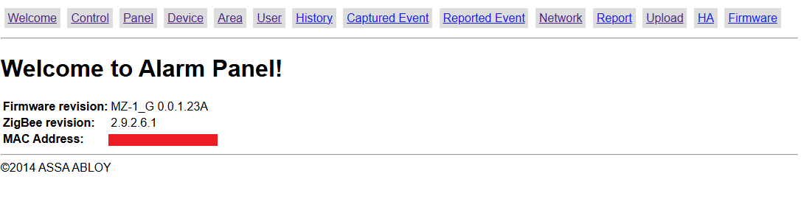
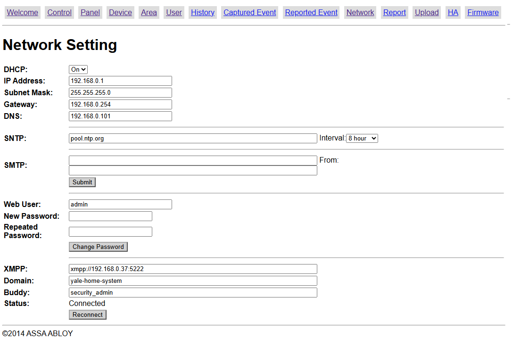
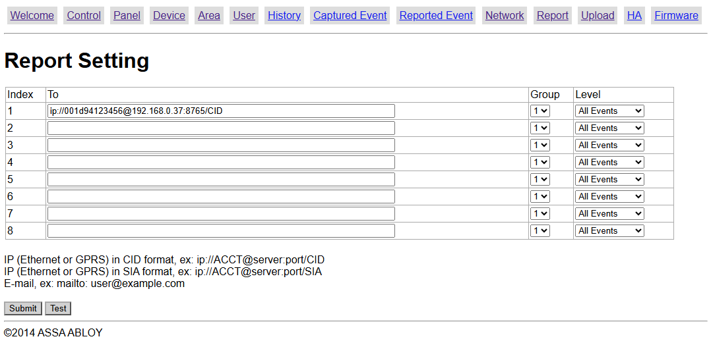
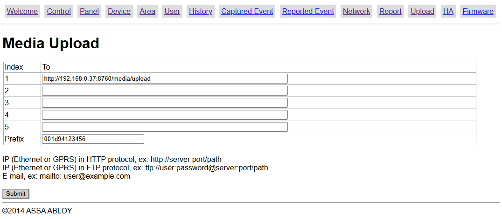

# Configuring an MZ-1 for use with this project

To complete configuration you must obtain access to the hub's internal web interface. 

**WARNING:** It has been reported on multiple forums that Yale explicitly do not allow customers access to the web interface on the alarm hub. If you are in there playing around while it is connected to their server **everything you do is reported to them via the XMPP interface. Reports of tinkerers finding their accounts locked exist. Proceed at your own risk.**

First the IP address of the hub on your local network must be determined. Run the server in this project and browse to the web interface at http://server_addres:8085/ where you should be able to see a list of alarms discovered on the local network.

Or you can download the Climax FINDER tool in Lupus branding from:
https://www.lupus-electronics.de/shop/documents/Software_Windows_LupusIPFinder_v1.0.13.zip 
It will find any Climax alarm system on a local network regardless of brand.

Enter `http://<ip_address>/` into your browser. You will be prompted for credentials. The username and password *should* be admin / admin1234. **NOTE**: These credentials will not work for later TLS-enabled alarm hubs.

First browse to the "Network" tab:

In the XMPP field change the hostname from `yalehomesystem.co.uk` to the address of your server. The domain and buddy fields aren't checked by this project. You should see the alarm negotiate and connect to your server in the logs within a few seconds. XMPP is the management interface for these alarms.

Now head to the "Report" tab:

Here we are setting the address real time notifications are sent to (they are not transmitted over the XMPP interface). These messages drive the email notifier service.

Once again replace the address of the Yale server with your own. Also change the account number (before the @) to the MAC address of the hub all lowercase as above. This is needed so that the server can identify the hub sending the message.

If you are using any PIR cameras head to the "Upload" tab:

Once again replace the address of the Yale server with your own. Change the path to `/media/upload`. Set the Prefix to the lowercase MAC address as before.

# That's it!

Your alarm's connection to Yale's server is now completely severed. All communications channels are redirected to your own server. You now have full ownership of your alarm system.