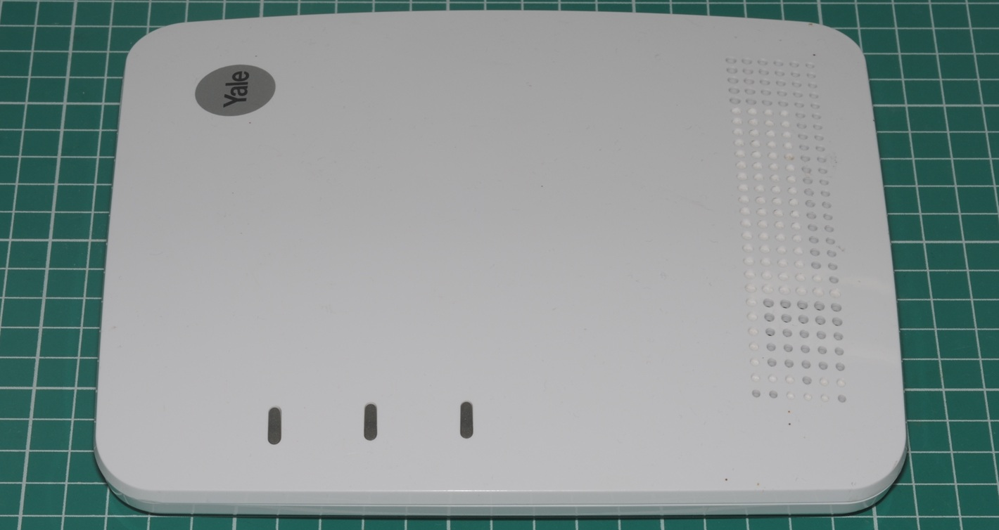
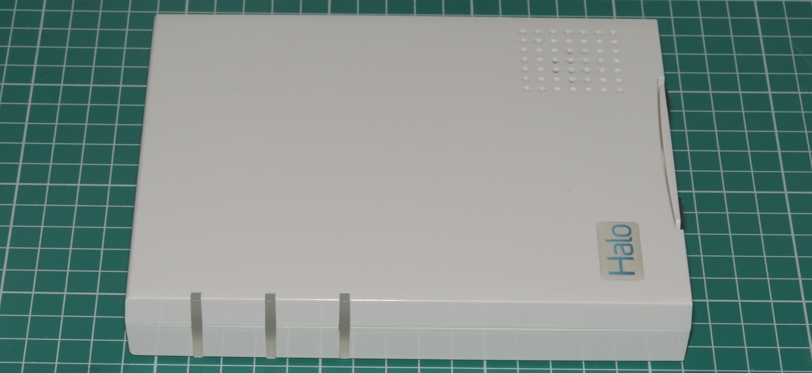
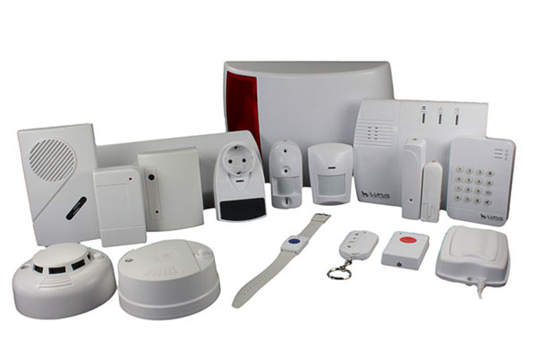
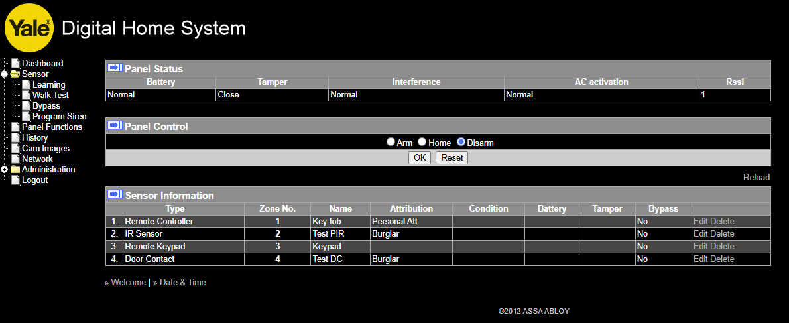
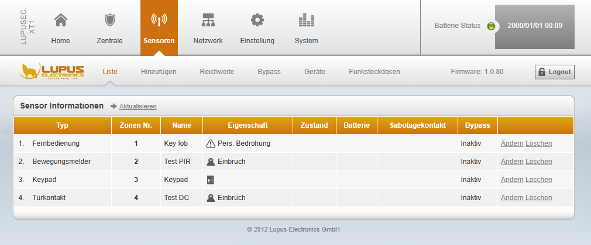
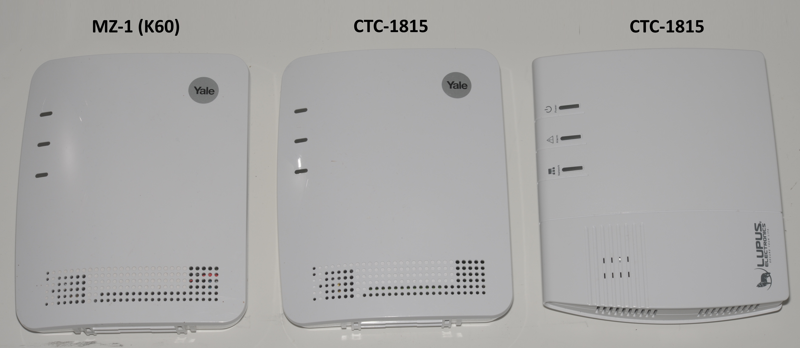
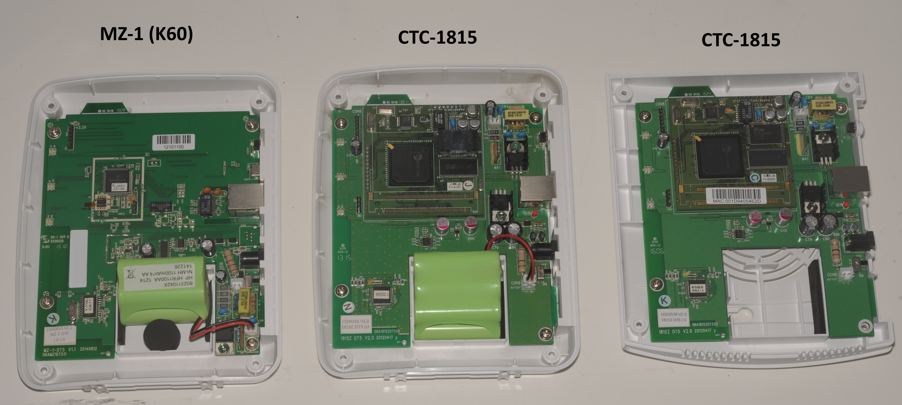

# Hardware

This page lists the systems studied for inclusion in this project.
# Yale branded MZ-1 K60 (supported)

Carries the Yale SKU "EF-IPBOX". Part of the Yale EF/SR accessory system. NOTE: There are three different hubs with this SKU. Only two will work with this project.

To identify the MZ-1 K60:

* SKU "EF-IPBOX"
* "V6" sticker on the rear
* "V1.1" sticker on the side
* "MAC Address" sticker on the side (important!)
* MCU inside labelled "ML_yaukoz 0.0.1.23A" (it will be if the above are true)

A OEM brochure for the MZ-1 can be found [here](manuals/mz_series_brochure.pdf). Also see the [OEM user manual](manuals/mz_user_manual.pdf).

This is an XMPP "ML" protocol alarm. It does not use TLS.

A TLS version exists (MZ-1-K64) which cannot be used with this project.
# Yale branded CTC-1815 (supported)

Also carries the Yale SKU "EF-IPBOX". Part of the Yale EF/SR accessory system.

To identify the CTC-1815:

* SKU "EF-IPBOX"
* No version sticker on the rear
* "V2.0" sticker on the side
* "MAC Address" sticker on the side (important!)
* Davicom DM9168GP SoC inside (should be if above are true)

This is a XMPP "Polling" protocol alarm. TLS is used but certificates are not validated. A OEM brochure for this product can be found [here](manuals/vst_1815_brochure.pdf).

# "Halo" branded CTC-1735 (supported)

These systems were sold in the UK over a decade ago. It is unclear if Halo was an actual company or a brand of Intamac whose name appears on the rear. Its firmware is completely unbranded.

This is an HTTP Polling protocol alarm.

# Lupus XT1 (CTC-1815) (Not supported)

A study of this German system concluded it is not a target for this project. While it contains the exact same PCB as its Yale counterpart; the XT1 was sold as an explicitly cloud-free smart alarm system; its firmware is *substantially* different. The hub features an excellent web based management interface (German language only) with a rich feature set. Customers are not only allowed, but *required* to manage the alarm through it. For remote access customers are asked to open a pinhole in their router (!).

XMPP interface code is present but inactive. It is not used in the Lupus solution.

User manuals for Lupus XT systems are impressive, containing hundreds of pages of technical detail about the system and its accessories.

Despite operating on the same radio frequency Yale accessories do not pair with it. It is possible to boot the Lupus firmware on the Yale hub after which it works with Yale accessories. This would suggest there is a brand code programmed into the radio firmware to prohibit inter-brand mixing of accessories.

Yale CTC-1815 running its own firmware

Exact same Yale CTC-1815 running the Lupus firmware

# TLS Enabled Yale hubs

If the hub has a "Serial Number" or "Serial No" sticker attached to then it is a later model which cannot be used with this project. These hubs communicate with the server exclusively by XMPP-TLS with strict certificate checking thus it is not possible to connect them to an alternate server without the original private key or some other unknown workaround.

# Inside Photographs

Left to right: Yale EF-IPBOX containing an MZ-1, Yale EF-IPBOX containing a CTC-1815, Lupus XT1 containing a CTC-1815.
