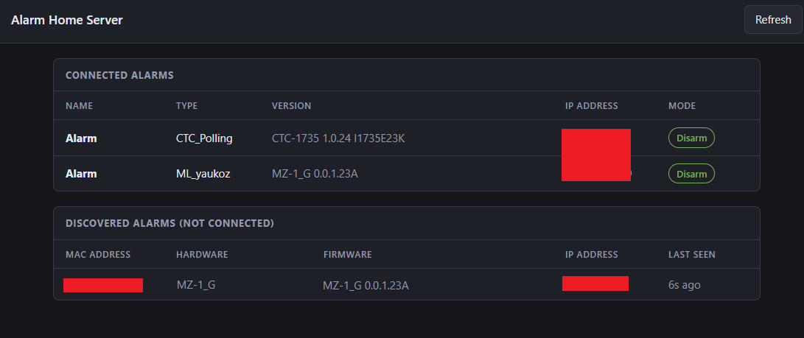
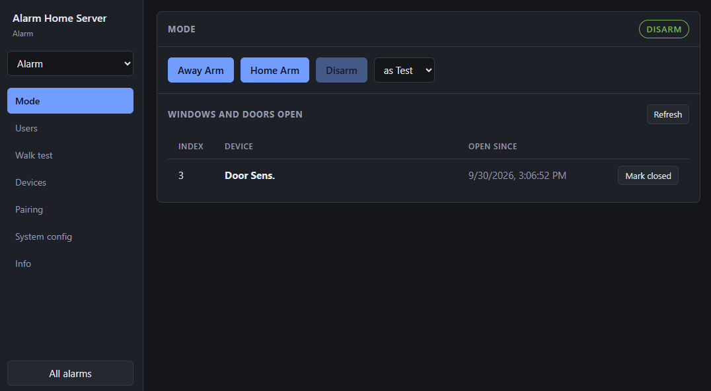
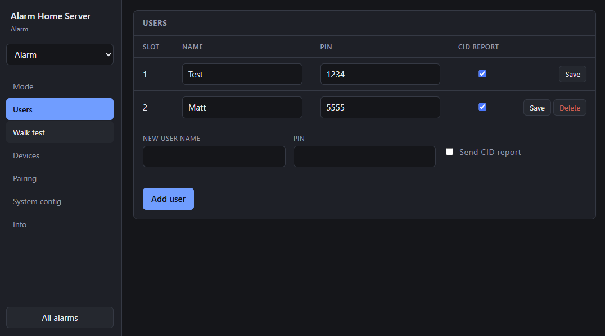
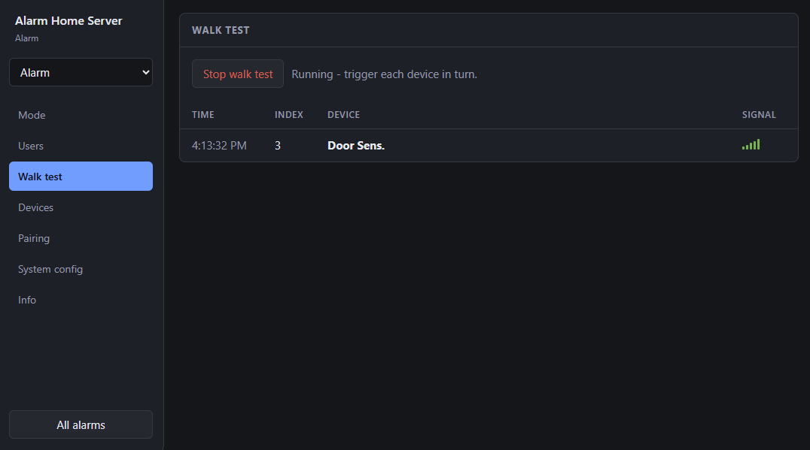
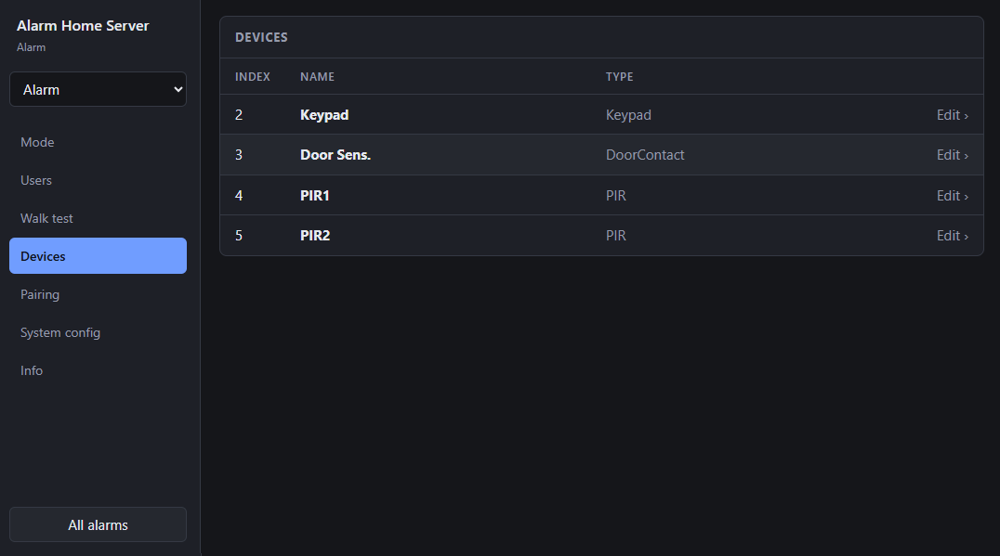
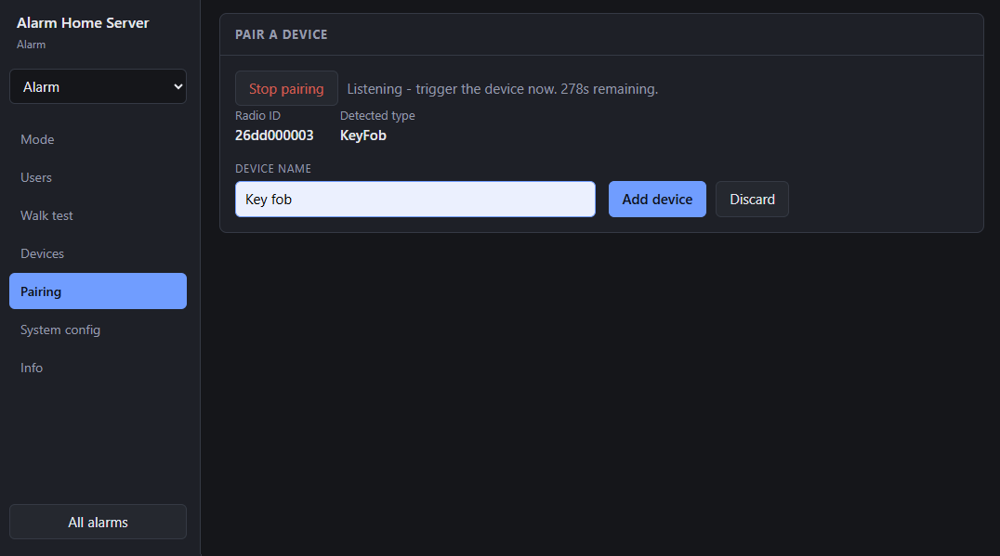
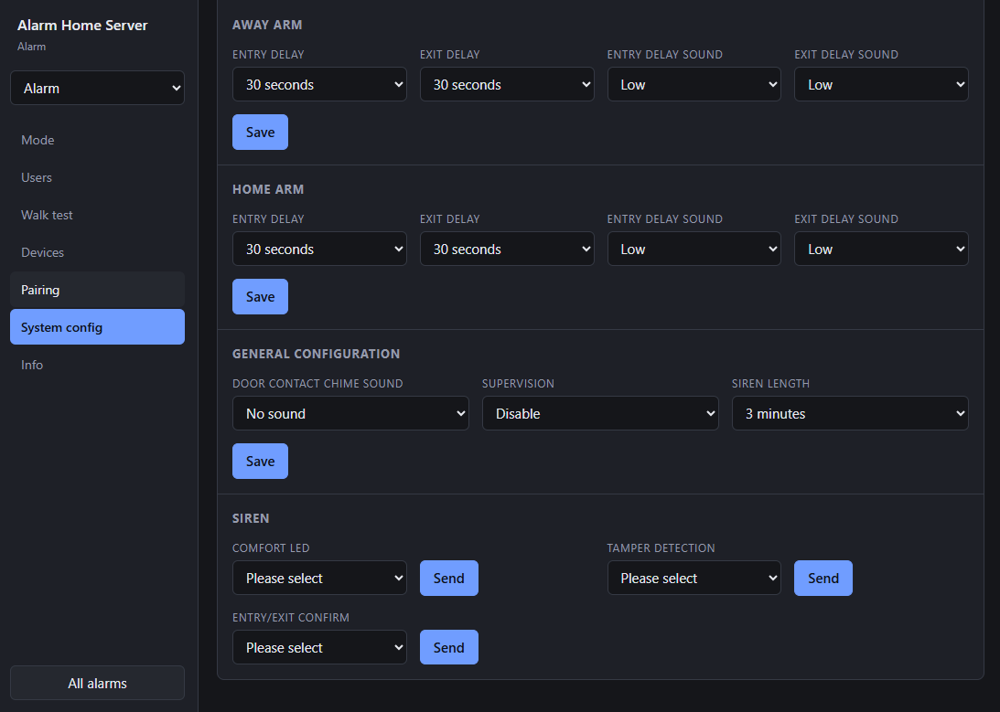

# Web Interface

As previously stated this interface is entirely AI generated. But it's pretty nice. User experience is far superior to the Yale app whose functionality it recreates.
# OpenAPI / Swagger 

Is available at `/docs` and `/openapi.json` respectively should you wish to vibe code your own UI.

# Welcome screen

Both connected and "discovered" (via UDP FINDER messages) alarms are shown on this screen.

# Mode screen

Includes listing of open door contacts.

# Edit users screen

# Walk test screen

# Edit devices screen

# Device pairing screen

# Settings screen
